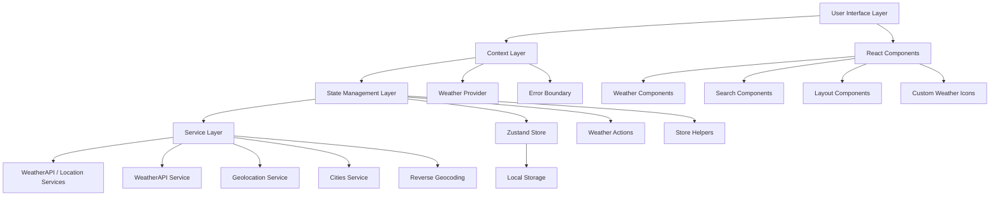
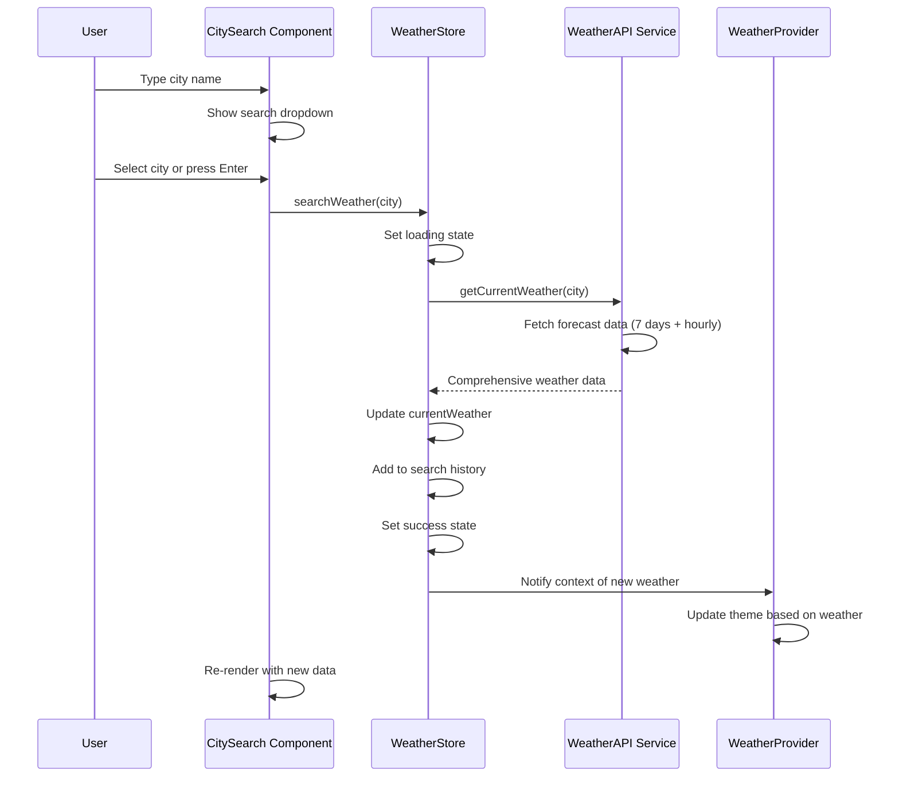
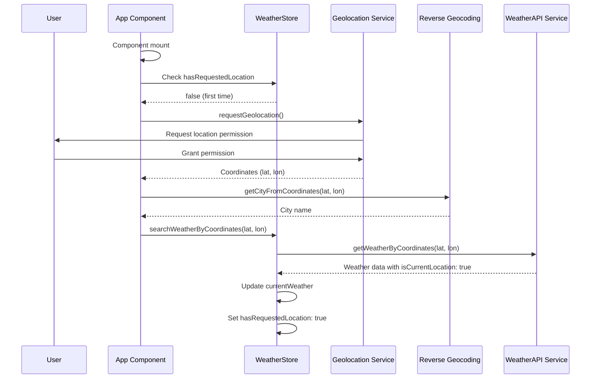
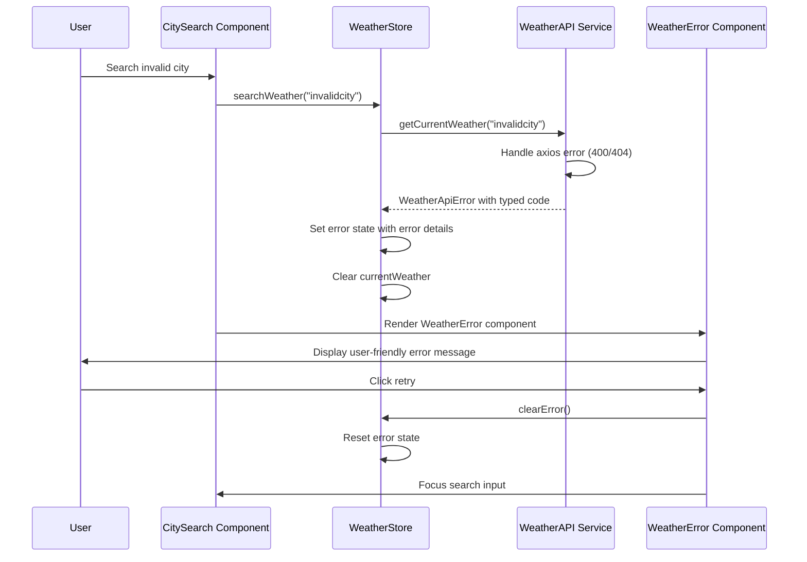

# Technical Architecture Documentation

## Overview

This document provides comprehensive technical information about the Weather App architecture, design decisions, implementation patterns, and advanced features including location services, forecasting, and dynamic theming.

## System Architecture

### High-Level Architecture



### Layer Responsibilities

#### 1. User Interface Layer

- **React Components**: UI rendering and user interactions
- **shadcn/ui Components**: Reusable, accessible UI primitives  
- **Custom Weather Icons**: SVG-based weather condition icons
- **Responsive Layouts**: Mobile-first responsive design
- **Dynamic Theming**: Weather-based background and styling

#### 2. Context Layer

- **WeatherProvider**: React context for weather data distribution
- **ErrorBoundary**: Application-level error catching and recovery
- **Theme Context**: Dynamic theme management based on weather conditions

#### 3. State Management Layer

- **Zustand Store**: Global application state with TypeScript
- **Persistence**: Selective localStorage synchronization
- **State Actions**: Modular business logic for state mutations
- **Store Helpers**: Utility functions for state management

#### 4. Service Layer

- **WeatherAPI Service**: HTTP client for comprehensive weather data
- **Geolocation Service**: Browser geolocation API integration
- **Cities Service**: City search and autocomplete functionality
- **Reverse Geocoding**: Convert coordinates to location names
- **Error Handling**: Centralized error management with typed errors

#### 5. External Layer

- **WeatherAPI**: Professional weather data provider with forecasts
- **Browser Geolocation**: Native location services
- **Local Storage**: Client-side persistence for user preferences
- **Cities Database**: Global cities database for search autocomplete

## Technology Stack

### Core Technologies

| Technology       | Version | Purpose           | Why Chosen                                                        |
| ---------------- | ------- | ----------------- | ----------------------------------------------------------------- |
| **React**        | 19.1    | UI Framework      | Latest features, concurrent rendering, improved performance       |
| **TypeScript**   | 5.8     | Type Safety       | Strict typing, better DX, compile-time error catching            |
| **Vite**         | 7.1     | Build Tool        | Lightning-fast HMR, native ESM, excellent dev experience        |
| **Tailwind CSS** | 4.1     | Styling           | Next-gen utility framework, JIT compilation, modern CSS features |
| **Axios**        | 1.12    | HTTP Client       | Request/response interceptors, automatic JSON handling           |

### State Management

| Technology                 | Purpose          | Why Chosen                                                     |
| -------------------------- | ---------------- | -------------------------------------------------------------- |
| **Zustand**                | Global State     | Lightweight, minimal boilerplate, excellent TypeScript support |
| **Persistence Middleware** | Data Persistence | Automatic localStorage sync, configurable serialization        |

### UI Components & Styling

| Technology             | Purpose               | Why Chosen                                                 |
| ---------------------- | --------------------- | ---------------------------------------------------------- |
| **shadcn/ui**          | Component Library     | Headless, accessible, customizable, copy-paste approach   |
| **Lucide React**       | Icons                 | Consistent icon set, tree-shakeable, excellent TS support |
| **CVA**                | Component Variants    | Type-safe styling, variant management, composable classes |
| **Tailwind Merge**     | Class Optimization    | Intelligent class merging, prevents style conflicts       |
| **clsx**               | Conditional Classes   | Utility for conditional className construction             |

### Testing & Quality

| Technology               | Purpose              | Why Chosen                                            |
| ------------------------ | -------------------- | ----------------------------------------------------- |
| **Vitest**               | Test Runner          | Native ESM, fastest testing, excellent Vite integration |
| **Testing Library**      | Component Testing    | User-centric testing, accessibility-focused          |
| **jsdom**                | DOM Environment      | Lightweight DOM simulation for unit tests            |
| **ESLint**               | Code Linting         | Code quality, consistency, TypeScript integration    |
| **Prettier**             | Code Formatting      | Consistent code style, automatic formatting          |
| **TypeScript Compiler** | Type Checking        | Static analysis, compile-time error detection        |

## Data Flow

### Weather Search Flow



### Location Services Flow



### Error Handling Flow



## State Management Design

### Store Architecture

The application uses a modular Zustand store with the following structure:

```typescript
interface WeatherState {
  // Current weather data
  currentWeather: WeatherData | null;

  // UI state
  loadingState: 'idle' | 'loading' | 'success' | 'error';
  error: WeatherError | null;

  // Search history
  searchHistory: SearchHistoryItem[];
  recentlyRemoved: SearchHistoryItem[];

  // Location services
  hasRequestedLocation: boolean;
  locationPermissionDenied: boolean;
  isRequestingLocation: boolean;

  // Actions (defined in separate modules)
  searchWeather: (city: string) => Promise<void>;
  searchWeatherByCoordinates: (lat: number, lon: number) => Promise<void>;
  addToHistory: (weather: WeatherData) => void;
  removeFromHistory: (id: string) => void;
  undoRemove: (id: string) => void;
  clearHistory: () => void;
  clearError: () => void;
  searchFromHistory: (item: SearchHistoryItem) => Promise<void>;
  setLocationPermissionDenied: (denied: boolean) => void;
  setIsRequestingLocation: (requesting: boolean) => void;
}
```

### State Persistence

```typescript
// Selective persistence - only persists user preferences and history
partialize: state => ({
  searchHistory: state.searchHistory,
  recentlyRemoved: state.recentlyRemoved,
  hasRequestedLocation: state.hasRequestedLocation,
  locationPermissionDenied: state.locationPermissionDenied,
});
```

**Why selective persistence?**

- **Performance**: Don't persist large weather objects or temporary UI state
- **Freshness**: Weather data should always be fetched fresh for accuracy
- **User Experience**: Preserve search history and location preferences
- **Privacy**: Respect user's location permission choices across sessions

## Component Architecture

### Component Hierarchy

```
App
├── ErrorBoundary
│   └── SidebarWithToggle
│       └── Sidebar
│           ├── SidebarHeader
│           ├── SearchHistoryList
│           │   └── SearchHistoryItem[]
│           └── UndoToast[]
├── WeatherProvider (Context)
│   └── WeatherMain
│       ├── CitySearch
│       │   ├── SearchInput
│       │   └── SearchDropdown
│       │       ├── CitySearchListItem[]
│       │       └── SearchDropdownLoading
│       ├── WeatherWrapper
│       │   ├── WeatherError (conditional)
│       │   ├── WelcomeMessage (conditional)
│       │   └── WeatherCentered (conditional)
│       │       ├── WeatherCurrent
│       │       ├── WeatherDetails
│       │       │   └── WeatherDetailCard[]
│       │       ├── HourlyForecast
│       │       │   └── HourlyForecastList
│       │       └── DailyForecast
│       │           └── DailyForecastItem[]
└── Custom Weather Icons (SVG components)
```

### Component Design Principles

#### 1. Single Responsibility

Each component has one clear purpose:

- `CitySearch`: Handle user input and city selection with autocomplete
- `WeatherCurrent`: Display current weather conditions and main metrics
- `WeatherDetails`: Show detailed weather metrics in organized cards
- `HourlyForecast`: Render 24-hour weather forecast with scrolling
- `DailyForecast`: Display 7-day weather forecast
- `SearchHistoryList`: Manage search history CRUD operations
- `SidebarWithToggle`: Handle sidebar visibility and responsive behavior

#### 2. Composition over Inheritance

Components are composed of smaller, reusable parts:

```typescript
// Good: Composition with actual components
<WeatherDetails />
<HourlyForecast />
<DailyForecast />

// Avoid: Large monolithic components
<WeatherDisplay />
```

#### 3. Props Interface Design

Clear, minimal prop interfaces with strong typing:

```typescript
interface WeatherMainProps {
  error: WeatherError | null;
  onRetry: () => void;
  sidebarOpen: boolean;
  isLightTheme: boolean;
}

interface DailyForecastItemProps {
  forecast: DailyForecastItem;
  isToday?: boolean;
}

interface SearchHistoryItemProps {
  item: SearchHistoryItem;
  onRemove: (id: string) => void;
  onSearch: (item: SearchHistoryItem) => void;
}
```

## 🔐 Type Safety Strategy

### Type Definitions

#### Domain Types

```typescript
// Core business entities with comprehensive weather data
interface WeatherData {
  id: string;
  city: string;
  country: string;
  temperature: number;
  description: string;
  minTemperature: number;
  maxTemperature: number;
  windSpeed: number;
  humidity: number;
  icon: string;
  timestamp: number;
  localtime?: string;
  isCurrentLocation?: boolean;
  // Extended forecast data
  sunrise?: string;
  sunset?: string;
  uv?: number;
  visibility?: number;
  pressure?: number;
  feelsLike?: number;
  moonPhase?: string;
  moonIllumination?: number;
  precipitation?: number;
  windGust?: number;
  hourlyForecast?: HourlyForecastItem[];
  dailyForecast?: DailyForecastItem[];
}

// WeatherAPI response types (extensive API contract)
interface ForecastApiResponse {
  location: ApiLocation;
  current: ApiCurrent;
  forecast: {
    forecastday: ApiForecastDay[];
  };
}

interface ApiLocation {
  name: string;
  region: string;
  country: string;
  lat: number;
  lon: number;
  tz_id: string;
  localtime_epoch: number;
  localtime: string;
}

// Detailed current weather data
interface ApiCurrent {
  last_updated_epoch: number;
  last_updated: string;
  temp_c: number;
  temp_f: number;
  is_day: number;
  condition: WeatherConditionWithCode;
  wind_mph: number;
  wind_kph: number;
  wind_degree: number;
  wind_dir: string;
  pressure_mb: number;
  pressure_in: number;
  precip_mm: number;
  precip_in: number;
  humidity: number;
  cloud: number;
  feelslike_c: number;
  feelslike_f: number;
  vis_km: number;
  vis_miles: number;
  uv: number;
  gust_mph: number;
  gust_kph: number;
}
```

#### Error Types

```typescript
interface WeatherError {
  message: string;
  code?: string;
}

class WeatherApiError extends Error {
  constructor(
    message: string,
    public code?: string,
    public statusCode?: number
  ) {
    super(message);
    this.name = 'WeatherApiError';
  }
}
```

### Type-Only Imports & Modern TypeScript Features

```typescript
// Use type-only imports for better tree-shaking
import type { WeatherData, HourlyForecastItem } from '../types/weather';
import type { FC, PropsWithChildren } from 'react';
import { weatherApiService } from '../services/weatherApi';

// Utility types for better type safety
type WeatherTheme = 'sunny' | 'cloudy' | 'rainy' | 'snowy' | 'foggy' | 'default';
type LoadingState = 'idle' | 'loading' | 'success' | 'error';

// Conditional types for better API modeling
type WeatherWithLocation<T extends boolean> = T extends true
  ? WeatherData & { isCurrentLocation: true }
  : WeatherData;
```

## 🧪 Testing Architecture

### Testing Strategy

#### 1. Test Pyramid

```
    /\
   /  \    E2E Tests (Manual testing)
  /____\
 /      \   Integration Tests (Component + Store)
/________\  Unit Tests (Services, Utilities, Components)
```

#### 2. Test Types

**Unit Tests**

- Service layer functions
- Individual component behavior
- Utility functions
- Error handling

**Integration Tests**

- Component + Store interactions
- API service + Error handling
- Search flow + History management

#### 3. Testing Utilities & Modern Testing Patterns

```typescript
// Custom render function for components with providers
function renderWithProviders(ui: ReactElement, options?: RenderOptions) {
  const Wrapper = ({ children }: PropsWithChildren) => (
    <ErrorBoundary>
      <WeatherProvider>{children}</WeatherProvider>
    </ErrorBoundary>
  );
  
  return render(ui, { wrapper: Wrapper, ...options });
}

// Mock services with proper TypeScript support
vi.mock('../services/weatherApi', () => ({
  weatherApiService: {
    getCurrentWeather: vi.fn(),
    getWeatherByCoordinates: vi.fn(),
  },
}));

// Mock Zustand store for isolated testing
const createMockStore = (initialState?: Partial<WeatherState>) =>
  create<WeatherState>(() => ({
    currentWeather: null,
    loadingState: 'idle',
    error: null,
    searchHistory: [],
    recentlyRemoved: [],
    hasRequestedLocation: false,
    locationPermissionDenied: false,
    isRequestingLocation: false,
    ...initialState,
    // Mock all action functions
    searchWeather: vi.fn(),
    searchWeatherByCoordinates: vi.fn(),
    addToHistory: vi.fn(),
    removeFromHistory: vi.fn(),
    undoRemove: vi.fn(),
    clearHistory: vi.fn(),
    clearError: vi.fn(),
    searchFromHistory: vi.fn(),
    setLocationPermissionDenied: vi.fn(),
    setIsRequestingLocation: vi.fn(),
  }));

// Hook testing utilities
function renderHook<T>(hook: () => T) {
  const { result } = renderHookFromTestingLibrary(hook);
  return result;
}
```

## 🔧 Service Layer Design

### API Service Architecture

#### Modern Service Architecture with Multiple APIs

```typescript
// Weather service interface with comprehensive methods
interface WeatherService {
  getCurrentWeather(city: string): Promise<WeatherData>;
  getWeatherByCoordinates(lat: number, lon: number): Promise<WeatherData>;
}

// Location service interface
interface LocationService {
  getCurrentPosition(): Promise<GeolocationPosition>;
  getCityFromCoordinates(lat: number, lon: number): Promise<string>;
}

// Cities service interface
interface CityService {
  searchCities(query: string): Promise<CityOption[]>;
}

// Real implementations with comprehensive error handling
class WeatherApiService implements WeatherService {
  private readonly baseUrl: string;
  private readonly apiKey: string;

  constructor(baseUrl = API_CONFIG.BASE_URL, apiKey = API_CONFIG.API_KEY) {
    this.baseUrl = baseUrl;
    this.apiKey = apiKey;
  }

  async getCurrentWeather(city: string): Promise<WeatherData> {
    // Comprehensive implementation with data transformation
  }

  async getWeatherByCoordinates(lat: number, lon: number): Promise<WeatherData> {
    // Location-based weather with enhanced data
  }
}

class GeolocationService implements LocationService {
  async getCurrentPosition(): Promise<GeolocationPosition> {
    return new Promise((resolve, reject) => {
      if (!navigator.geolocation) {
        reject(new Error('Geolocation is not supported'));
        return;
      }

      navigator.geolocation.getCurrentPosition(resolve, reject, {
        enableHighAccuracy: true,
        timeout: 10000,
        maximumAge: 300000, // 5 minutes
      });
    });
  }

  async getCityFromCoordinates(lat: number, lon: number): Promise<string> {
    // Reverse geocoding implementation
  }
}
```

#### Modern Error Handling with Axios

```typescript
// Comprehensive error handling with detailed error codes
async getCurrentWeather(city: string): Promise<WeatherData> {
  if (!city.trim()) {
    throw new WeatherApiError(ERROR_MESSAGES.INVALID_INPUT, 'INVALID_INPUT');
  }

  const url = this.buildUrl(API_CONFIG.ENDPOINTS.FORECAST, {
    key: this.apiKey,
    q: city.trim(),
    days: '7',
    aqi: 'no',
    alerts: 'no',
  });

  try {
    const response: AxiosResponse<ForecastApiResponse> = await axios.get(url);
    return this.transformForecastData(response.data);
  } catch (error) {
    if (error instanceof WeatherApiError) {
      throw error; // Re-throw known errors
    }

    if (axios.isAxiosError(error)) {
      if (error.response) {
        await this.handleAxiosError(error.response.status);
      } else if (error.request) {
        throw new WeatherApiError(
          ERROR_MESSAGES.NETWORK_ERROR,
          'NETWORK_ERROR'
        );
      } else {
        throw new WeatherApiError(error.message, 'REQUEST_ERROR');
      }
    }

    throw new WeatherApiError(ERROR_MESSAGES.NETWORK_ERROR, 'NETWORK_ERROR');
  }
}

// Detailed error code mapping
private async handleAxiosError(statusCode: number): Promise<never> {
  switch (statusCode) {
    case 400:
    case 404:
      throw new WeatherApiError(
        ERROR_MESSAGES.CITY_NOT_FOUND,
        'CITY_NOT_FOUND',
        statusCode
      );
    case 401:
      throw new WeatherApiError(
        'Invalid API key. Please check your WeatherAPI key.',
        'INVALID_API_KEY',
        statusCode
      );
    case 403:
      throw new WeatherApiError(
        'API key has exceeded calls per month quota.',
        'QUOTA_EXCEEDED',
        statusCode
      );
    case 429:
      throw new WeatherApiError(
        ERROR_MESSAGES.RATE_LIMIT,
        'RATE_LIMIT',
        statusCode
      );
    default:
      throw new WeatherApiError(
        ERROR_MESSAGES.API_ERROR,
        'API_ERROR',
        statusCode
      );
  }
}
```

#### Comprehensive Data Transformation

```typescript
// Transform WeatherAPI forecast response to comprehensive internal format
private transformForecastData(data: ForecastApiResponse): WeatherData {
  const today = data.forecast.forecastday[0];
  const current = data.current;
  const astro = today.astro;

  // Get current hour's data for accurate hourly metrics
  const currentHour = today.hour.find(
    hour => hour.time_epoch <= current.last_updated_epoch
  ) || today.hour[0];

  return {
    id: `${data.location.name}-${data.location.country}-${Date.now()}`,
    city: data.location.name,
    country: data.location.country,
    temperature: Math.round(current.temp_c),
    description: current.condition.text,
    minTemperature: Math.round(today.day.mintemp_c),
    maxTemperature: Math.round(today.day.maxtemp_c),
    windSpeed: current.wind_kph / 3.6, // Convert km/h to m/s
    humidity: current.humidity,
    icon: current.condition.icon.replace('//', 'https://'),
    timestamp: current.last_updated_epoch * 1000,
    localtime: data.location.localtime,
    // Extended weather data
    sunrise: astro.sunrise,
    sunset: astro.sunset,
    uv: today.day.uv,
    visibility: today.day.avgvis_km,
    pressure: currentHour.pressure_mb,
    feelsLike: Math.round(current.feelslike_c),
    moonPhase: astro.moon_phase,
    moonIllumination: astro.moon_illumination,
    precipitation: today.day.totalprecip_mm,
    windGust: currentHour.gust_kph / 3.6,
    // Transform hourly forecast (24+ hours)
    hourlyForecast: this.transformHourlyForecast(data.forecast.forecastday),
    // Transform daily forecast (7 days)
    dailyForecast: this.transformDailyForecast(data.forecast.forecastday),
  };
}

private transformHourlyForecast(forecastDays: ApiForecastDay[]): HourlyForecastItem[] {
  const allHours: HourlyForecastItem[] = [];
  
  forecastDays.forEach(day => {
    day.hour.forEach(hour => {
      allHours.push({
        time: hour.time,
        temp_c: hour.temp_c,
        condition: {
          text: hour.condition.text,
          icon: hour.condition.icon,
        },
      });
    });
  });

  return allHours;
}

private transformDailyForecast(forecastDays: ApiForecastDay[]): DailyForecastItem[] {
  const dayNames = ['Sunday', 'Monday', 'Tuesday', 'Wednesday', 'Thursday', 'Friday', 'Saturday'];
  
  return forecastDays.map((day, index) => {
    const date = new Date(day.date);
    const dayName = index === 0 ? 'Today' : dayNames[date.getDay()];

    return {
      date: day.date,
      day: dayName,
      maxTemp: Math.round(day.day.maxtemp_c),
      minTemp: Math.round(day.day.mintemp_c),
      condition: {
        text: day.day.condition.text,
        icon: day.day.condition.icon,
      },
    };
  });
}
```

## 🎨 Styling Architecture

### Dynamic Theming System

#### Weather-Based Color System

```typescript
// Dynamic weather themes with Tailwind v4
const weatherThemes = {
  sunny: {
    background: 'from-blue-400 via-blue-500 to-blue-600',
    text: 'text-white',
    accent: 'text-yellow-300',
  },
  cloudy: {
    background: 'from-gray-400 via-gray-500 to-gray-600',
    text: 'text-white',
    accent: 'text-blue-300',
  },
  rainy: {
    background: 'from-slate-600 via-slate-700 to-slate-800',
    text: 'text-white',
    accent: 'text-blue-400',
  },
  snowy: {
    background: 'from-blue-100 via-blue-200 to-blue-300',
    text: 'text-gray-800',
    accent: 'text-blue-600',
  },
  foggy: {
    background: 'from-gray-300 via-gray-400 to-gray-500',
    text: 'text-white',
    accent: 'text-gray-200',
  },
  default: {
    background: 'from-blue-500 via-blue-600 to-blue-700',
    text: 'text-white',
    accent: 'text-blue-200',
  },
};

// Time-based theme modifications
const timeModifiers = {
  night: {
    backgroundOverlay: 'bg-gradient-to-b from-slate-900/40 to-slate-900/60',
    textDarkening: 'brightness-75',
  },
  day: {
    backgroundOverlay: 'bg-gradient-to-b from-white/10 to-white/20',
    textBrightening: 'brightness-110',
  },
};

// CSS Custom Properties with dynamic updates
:root {
  --background: 0 0% 100%;
  --foreground: 222.2 84% 4.9%;
  --primary: 222.2 47.4% 11.2%;
  --secondary: 210 40% 96%;
  --accent: 210 40% 96%;
  --destructive: 0 84.2% 60.2%;
  --border: 214.3 31.8% 91.4%;
  --input: 214.3 31.8% 91.4%;
  --ring: 222.2 84% 4.9%;
  --radius: 0.5rem;
}

// Dark mode support
.dark {
  --background: 222.2 84% 4.9%;
  --foreground: 210 40% 98%;
  --primary: 210 40% 98%;
  --secondary: 222.2 47.4% 11.2%;
  --accent: 217.2 32.6% 17.5%;
  --destructive: 0 62.8% 30.6%;
  --border: 217.2 32.6% 17.5%;
  --input: 217.2 32.6% 17.5%;
  --ring: 212.7 26.8% 83.9%;
}
```

#### Weather Theme Hook

```typescript
// Custom hook for dynamic weather theming
export const useWeatherTheme = (weather: WeatherData | null) => {
  const getWeatherTheme = useCallback((weatherData: WeatherData | null): WeatherTheme => {
    if (!weatherData) return 'default';
    
    const condition = weatherData.description.toLowerCase();
    
    if (condition.includes('sun') || condition.includes('clear')) return 'sunny';
    if (condition.includes('cloud') || condition.includes('overcast')) return 'cloudy';
    if (condition.includes('rain') || condition.includes('drizzle')) return 'rainy';
    if (condition.includes('snow') || condition.includes('blizzard')) return 'snowy';
    if (condition.includes('fog') || condition.includes('mist')) return 'foggy';
    
    return 'default';
  }, []);

  const isNightTime = useCallback((weatherData: WeatherData | null): boolean => {
    if (!weatherData?.localtime) return false;
    
    const hour = new Date(weatherData.localtime).getHours();
    return hour < 6 || hour > 18; // Simple day/night logic
  }, []);

  const theme = getWeatherTheme(weather);
  const isNight = isNightTime(weather);
  const isLightTheme = theme === 'snowy' || (!isNight && theme === 'sunny');

  const backgroundClass = useMemo(() => {
    const baseGradient = weatherThemes[theme].background;
    const timeOverlay = isNight ? timeModifiers.night.backgroundOverlay : timeModifiers.day.backgroundOverlay;
    
    return `bg-gradient-to-br ${baseGradient} ${timeOverlay}`;
  }, [theme, isNight]);

  const textContrastClass = useMemo(() => {
    return weatherThemes[theme].text;
  }, [theme]);

  return {
    theme,
    isNight,
    isLightTheme,
    backgroundClass,
    textContrastClass,
    accentClass: weatherThemes[theme].accent,
  };
};
```

#### Component Variants

```typescript
// Using CVA for type-safe component variants
const buttonVariants = cva(
  'inline-flex items-center justify-center rounded-md', // base styles
  {
    variants: {
      variant: {
        default: 'bg-primary text-primary-foreground',
        destructive: 'bg-destructive text-destructive-foreground',
        outline: 'border border-input bg-background',
      },
      size: {
        default: 'h-10 px-4 py-2',
        sm: 'h-9 rounded-md px-3',
        lg: 'h-11 rounded-md px-8',
      },
    },
    defaultVariants: {
      variant: 'default',
      size: 'default',
    },
  }
);
```

### Responsive Design

```typescript
// Mobile-first responsive design
<div className="grid lg:grid-cols-3 gap-6">
  <div className="lg:col-span-2 space-y-6">
    {/* Main content */}
  </div>
  <div className="lg:col-span-1">
    {/* Sidebar */}
  </div>
</div>
```

## 🚀 Performance Optimizations

### Bundle Optimization

#### Tree Shaking

- Type-only imports where possible
- Individual icon imports: `import { Search } from 'lucide-react'`
- Selective re-exports

#### Code Splitting

```typescript
// Lazy loading for large features (future enhancement)
const WeatherDetails = lazy(() => import('./WeatherDetails'));
```

### Runtime Optimizations

#### Memoization

```typescript
// Memoize expensive calculations
const formatTime = useMemo(() => {
  return new Date(timestamp).toLocaleTimeString();
}, [timestamp]);
```

#### Debouncing (Future Enhancement)

```typescript
// Debounce search input
const debouncedSearch = useDebounce(searchTerm, 300);
```

## 🔒 Security Considerations

### Input Validation

```typescript
// Validate and sanitize user input
async getCurrentWeather(city: string): Promise<WeatherData> {
  if (!city.trim()) {
    throw new WeatherApiError(ERROR_MESSAGES.INVALID_INPUT)
  }

  const sanitizedCity = city.trim() // Basic sanitization
  // ... API call
}
```

### API Key Management

```typescript
// Environment variables for sensitive data
const API_CONFIG = {
  API_KEY: process.env.VITE_WEATHER_API_KEY || 'demo_key',
  // Never commit real API keys to version control
};
```

### XSS Prevention

- Using React's built-in XSS protection
- Sanitizing user input before storage
- Using TypeScript for additional type safety

## 📈 Scalability Considerations

### Adding New Features

#### New Weather Providers

```typescript
// Easy to add new weather services
interface WeatherProvider {
  getCurrentWeather(city: string): Promise<WeatherData>;
  getForecast?(city: string): Promise<ForecastData>;
}

class AccuWeatherService implements WeatherProvider {
  // Implementation
}
```

#### New Data Types

```typescript
// Extensible type system
interface ForecastData extends WeatherData {
  forecast: DailyForecast[];
}

interface DailyForecast {
  date: string;
  temperature: number;
  description: string;
}
```

### Performance at Scale

#### Virtual Scrolling (Future)

For large search histories:

```typescript
// Virtual scrolling for performance
<VirtualList
  items={searchHistory}
  renderItem={({ item }) => <SearchHistoryItem item={item} />}
  height={400}
/>
```

#### Request Deduplication (Future)

```typescript
// Prevent duplicate API calls
const requestCache = new Map<string, Promise<WeatherData>>()

async getCurrentWeather(city: string): Promise<WeatherData> {
  const cacheKey = city.toLowerCase()

  if (requestCache.has(cacheKey)) {
    return requestCache.get(cacheKey)!
  }

  const request = this.fetchWeather(city)
  requestCache.set(cacheKey, request)

  return request
}
```

## 🔍 Monitoring and Debugging

### Error Tracking

```typescript
// Structured error reporting
class WeatherApiError extends Error {
  constructor(
    message: string,
    public code?: string,
    public statusCode?: number,
    public context?: Record<string, any>
  ) {
    super(message);
    this.name = 'WeatherApiError';

    // Future: Send to error tracking service
    // errorTracker.captureException(this)
  }
}
```

### Performance Monitoring

```typescript
// Performance metrics collection
const performanceMetrics = {
  apiResponseTime: 0,
  searchesToHistory: 0,
  errorRate: 0,
};

// Future: Send metrics to analytics service
```

## 🎯 Future Enhancements

### Planned Features

1. **Weather Forecasts**: 5-day weather forecasts
2. **Favorite Locations**: Pin frequently searched cities
3. **Weather Alerts**: Severe weather notifications
4. **Maps Integration**: Visual weather maps
5. **Offline Support**: PWA with offline capabilities

### Technical Improvements

1. **Caching Layer**: Redis/localStorage for API responses
2. **Real-time Updates**: WebSocket for live weather updates
3. **Advanced Testing**: E2E tests with Playwright
4. **Performance**: Service Worker for background updates
5. **Accessibility**: Enhanced screen reader support

### Scalability Enhancements

1. **Micro-frontends**: Split into independent modules
2. **CDN Integration**: Optimize asset delivery
3. **Database**: Move from localStorage to proper database
4. **Backend**: Dedicated API server with rate limiting
5. **Monitoring**: Comprehensive observability stack

---

This technical documentation provides the foundation for understanding, maintaining, and extending the Weather App codebase.
